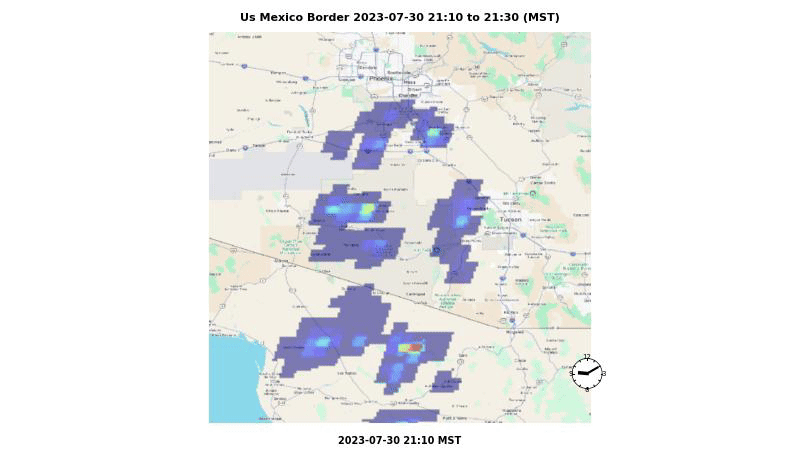

# scintilla

**A NASA Earth-science data pipeline for searching, downloading, clipping, and animating lightning data.** Primary use case: generate time-lapse maps of real thunderstorms from public NASA datasets — GLM on the GOES-R series (geostationary), and ISS LIS on the International Space Station (low Earth orbit).



> **Watch the full-resolution version on YouTube:** <https://youtu.be/5yVm39Y9xTs>

---

## Quickstart

The repo ships with a ~23 MB demo subset (raw GLM frames and one ISS LIS orbit file) so you can render a real storm animation on a fresh clone without any NASA credentials.

```bash
git clone https://github.com/cjt31415/scintilla.git
cd scintilla

# Create the conda env (mandatory — the GDAL/PROJ/cartopy stack is fragile on pip-only)
conda env create -f environment.yml
conda activate scintilla

# Render the demo animation
./src/scintilla/animate/movie_map.py \
    --aoi us-mexico-border \
    --start-date "2023-07-30 21:10" --end-date "2023-07-30 21:30" \
    --layers glm isslis \
    --output-format mp4
```

The output lands at `data/movies/us-mexico-border_2023-07-30_2110_2023-07-30_2130.mp4`.

### What just happened?

1. `movie_map.py` looked up the `us-mexico-border` AOI from `data/aois/us-mexico-border_aoi.geojson` — a hand-drawn bounding box over the US/Mexico border storm region.
2. It walked the 20-minute window at 1-minute steps, clipping each raw GLM NetCDF frame from `data/glm_raw/G18/2023/7/31/` down to the AOI polygon and writing per-frame GeoTIFFs to `data/glm_clips/`.
3. It loaded the matching ISS LIS orbit file from `data/isslis/2023/7/31/` and overlaid the ~229 magenta flash markers onto the frames where the ISS was actually passing overhead.
4. It encoded the frames into an mp4 via ffmpeg.

The demo is a complete, runnable slice of the full pipeline — the same code path you'd use for any storm, just with the data pre-staged.

---

## Going beyond the demo

The 23 MB bundled demo is a *teaser*. To run the pipeline against your own storms you'll need:

1. **A NASA EarthData account** (free, takes 2 minutes) — credentials go in `~/.netrc`. See [`docs/INSTALL.md`](docs/INSTALL.md) for setup.
2. **An AOI** — a GeoJSON bounding box over the region you care about. Draw one at <https://geojson.io> and save as `data/aois/<name>_aoi.geojson`. For 16:9 animation framing, pipe it through `src/scintilla/tools/aoi_to_16-9.py`.
3. **The full pipeline** — search granules, download, clip, animate. See [`docs/WORKFLOWS.md`](docs/WORKFLOWS.md) for the common command sequences and [`docs/GLM_Lightning_Pipeline.md`](docs/GLM_Lightning_Pipeline.md) for the end-to-end architecture.

### Finding interesting storms

The pipeline is fed by `(date, place)` pairs — somewhere a thunderstorm happened that's worth animating. Two complementary ways to find them:

1. **ISS LIS lightning** — query a parquet index of every flash the ISS Lightning Imaging Sensor detected during 2017-2023. Direct, lightning-specific, globally uniform. Best when the date you care about falls within the ISS LIS mission lifetime (ended December 2023).
2. **Weather station rainfall** — scan ISD (Integrated Surface Database) hourly observations for stations reporting heavy rainfall, then look for thunderstorms nearby. Slower and noisier, but works everywhere/everywhen — including post-2023.

`find_isslis_overlaps.py --discover` bins every flash in the index into 1°×1° cells and surfaces the densest cells that aren't already inside an existing AOI's bounding box. Two modes:

- `--mode all-time` finds *persistent* hotspots — places that consistently get hit (Catatumbo, Lake Kivu, northern Pakistan).
- `--mode by-day` finds *single-day storm events* — concrete `(date, lat, lon)` tuples ready to feed into the GLM animation workflow.

See [`docs/README_ISSLIS.md`](docs/README_ISSLIS.md) for the full discovery workflow.

---

## A real finding from this pipeline

Running the same storm through both GLM satellites (GOES-East `G16` and GOES-West `G18`) revealed a real geometric limitation. At the northeast corner of a Manitoba AOI in June 2023, GOES-West sees the region at ~74° zenith angle, where its optical detection efficiency drops significantly. GOES-East, looking at the same storm from ~62° zenith, catches **80% more non-zero pixel-minutes** and **2.4× more total optical energy** — and the G16 detections overlay exactly on the ISS LIS flash markers that were standing alone in the G18 render.

The full analysis — zenith-angle math, empirical comparison numbers, and a discussion of multi-satellite fusion — is in [`docs/glm_sensor_coverage.md`](docs/glm_sensor_coverage.md). This pipeline was built to render storm animations, but it's also a usable tool for validating lightning-sensor coverage claims.

---

## Documentation

| Doc | What it covers |
|---|---|
| [`docs/INSTALL.md`](docs/INSTALL.md) | Conda env setup, NASA EarthData credentials, troubleshooting |
| [`docs/WORKFLOWS.md`](docs/WORKFLOWS.md) | Day-to-day command sequences for common tasks |
| [`docs/GLM_Lightning_Pipeline.md`](docs/GLM_Lightning_Pipeline.md) | End-to-end architecture and per-step script reference |
| [`docs/README_ISSLIS.md`](docs/README_ISSLIS.md) | ISS LIS data flow, parquet index, discovery tool |
| [`docs/glm_sensor_coverage.md`](docs/glm_sensor_coverage.md) | GLM zenith-angle geometry, G16 vs G18 validation, fusion sketch |
| [`docs/GLM_ISSLIS_cross_sensor_validation.md`](docs/GLM_ISSLIS_cross_sensor_validation.md) | Cross-sensor spatial-accuracy validation (~9 km agreement) |
| [`docs/DECISIONS.md`](docs/DECISIONS.md) | Architectural decisions and rejected approaches |

---

## License

MIT — see [`LICENSE`](LICENSE).

## Citation

If you use scintilla or its derived findings in published work, please cite:

> Turner, C. (2026). *scintilla: a pipeline for NASA GLM + ISS LIS lightning animation and analysis.* GitHub: https://github.com/cjt31415/scintilla
