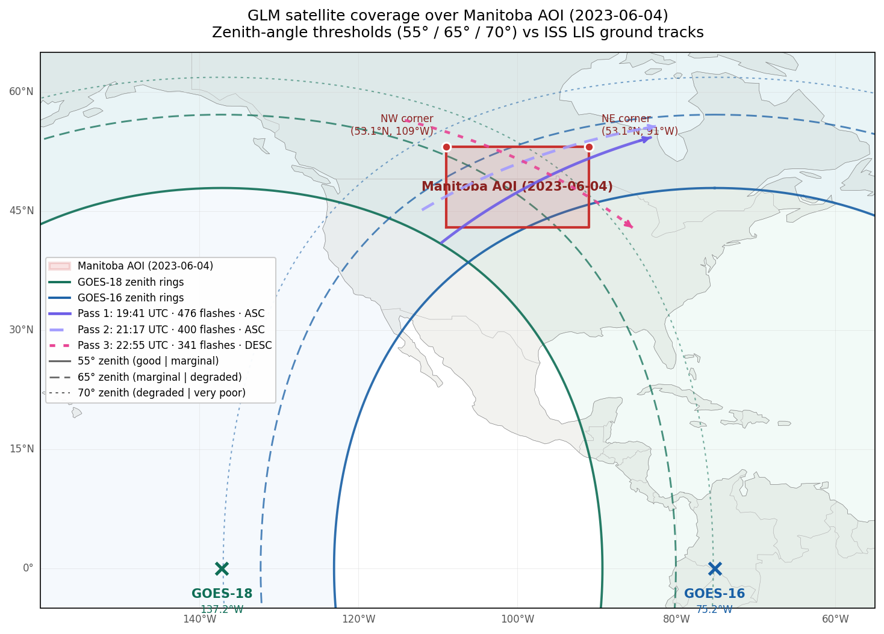

# GLM sensor coverage: zenith-angle geometry and multi-satellite fusion

## The observation

While watching the 2023-06-04 Manitoba highlight render (see [`highlight_2023_06_04_manitoba.md`](highlight_2023_06_04_manitoba.md)), a consistent visual pattern appeared: **the northeast quadrant of the AOI had essentially no GLM detections, but when ISS LIS flew over, it lit up magenta flash markers in exactly that region** — overlapping in the center and western parts where GLM was also detecting, but standing alone in the NE where GLM saw nothing.

This isn't a bug. It's a **geometric artifact of GOES-West's viewing angle** at that AOI.



The figure above shows the geometry at a glance: GLM-18 (green, sub-point at 137°W) and GLM-16 (blue, sub-point at 75°W) each with concentric zenith-angle rings at 55° / 65° / 70° — the empirical "good / marginal / degraded / very poor" detection bands from this analysis. The Manitoba AOI straddles GLM-18's 65° ring, with the NE corner pushed past it into degraded territory. Symmetrically, the NW corner of the AOI is the farthest point from GLM-16's sub-point, putting *it* near GLM-16's 55° ring — so the two satellites have mirrored weak spots on opposite sides of the box. The three ISS LIS ground tracks (magenta/purple) cross the AOI from different angles, each catching a different slice of the storm evolution.

## The physical cause

GLM is a lightning sensor on the Geostationary Operational Environmental Satellites (GOES-R series). Each satellite sits 35,786 km above the equator at a fixed longitude:

- **GOES-West (GOES-18)** — sub-satellite point at −137.2°W
- **GOES-East (GOES-16)** — sub-satellite point at −75.2°W

GLM looks straight down through its narrow field-of-view (1.08° × 1.08°) and detects transient optical pulses from cloud-top lightning in the 777.4 nm oxygen triplet. Detection efficiency (DE) is high near the sub-satellite point and **drops off sharply with zenith angle** (the angle between "straight up from the ground point" and "direction to the satellite"):

| Satellite zenith angle | Typical GLM detection efficiency |
|---|---|
| 0° – 40° | ~70–85% (nominal) |
| 40° – 55° | ~50–70% (mild degradation) |
| 55° – 65° | ~40–55% (marginal) |
| 65° – 70° | ~25–40% (degraded) |
| > 70° | **< 25% (poor to very poor)** |

Three physical effects compound at high zenith angle:

1. **Slant-path atmospheric attenuation** — light from the flash has to traverse more atmosphere at an oblique angle, so a larger fraction is absorbed or scattered away before reaching the satellite.
2. **Cloud-top obscuration by adjacent storm cells** — at steep angles, neighboring cloud tops physically block the satellite's view of the lightning-emitting volume.
3. **Instrument cosine response** — the optical system's effective collection area shrinks as the cosine of the incidence angle on the focal plane.

For a storm directly beneath GOES-18's sub-satellite point, the satellite looks straight down, so zenith angle is 0° and DE is ~80%. For a storm near the edge of GOES-18's Earth disk, zenith angle can approach 80° and DE can drop below 15%.

## The 2023-06-04 AOI is near GLM-18's eastern edge

The Manitoba AOI is centered at **(48°N, −100°W)**. That's 37° of longitude east of GOES-West's sub-satellite point. The eastern edge of the AOI (−91°W) is 46° east of GOES-West. Computing the actual satellite zenith angle at each corner:

### Geostationary satellite zenith angle formula

For a ground point at (lat, lon) and a geostationary satellite at (0°, `sat_lon`):

```
β = acos(cos(lat) * cos(lon - sat_lon))         # Earth-center angle
d = sqrt(Rg² + Re² - 2·Re·Rg·cos(β))             # slant range
cos(zenith) = (Rg·cos(β) - Re) / d
```

Where `Re` = 6378.14 km (Earth equatorial radius) and `Rg` = 42164.17 km (geostationary orbit radius from Earth center). At the sub-satellite point (β=0), `cos(zenith) = (Rg−Re)/(Rg−Re) = 1`, so zenith = 0°. At 90° angular separation, zenith = 90° (horizon-limited).

### Corner values for the `mb-2023-06-04_169` AOI

AOI bbox after 16:9 snap: lat 42.94° – 53.06°, lon −109.00° – −91.00° (per `aoi_snap_aspect.py` output).

| Corner | Lat | Lon | GLM-18 (−137.2°W) | GLM-16 (−75.2°W) |
|---|---|---|---|---|
| NW | 53.0°N | −109.0°W | 65.9° *poor* | 68.1° *poor* |
| **NE** | **53.0°N** | **−91.0°W** | **73.7° *very poor*** | **62.3° *marginal*** |
| Center | 48.0°N | −100.0°W | 65.7° *poor* | 60.1° *marginal* |
| SW | 43.0°N | −109.0°W | 57.2° *marginal* | 60.1° *marginal* |
| SE | 43.0°N | −91.0°W | 67.6° *poor* | **52.1° *good*** |

**The NE corner is at 73.7° zenith angle from GLM-18** — deep in the "very poor" regime where GLM catches well under a quarter of actual flashes. Combined with the high latitude (53°N approaches GLM's pole-limited FOV edge), this part of the AOI is effectively dark to GOES-West.

That matches the observation exactly. Storms moving through the NE quadrant produce ISS LIS detections (because LIS is in low Earth orbit and always looks near-nadir) but no GLM detections (because GOES-West can't see them through the steep viewing angle).

### Why GLM-16 would fix it

The right column of the table shows why. From **GOES-East** at −75.2°W:

- The SE corner drops from 67.6° (poor) all the way to **52.1° (good)** — near-nominal detection efficiency
- The NE corner drops from 73.7° (very poor) to **62.3° (marginal)** — a huge improvement at the specific region that's blank today
- The center drops from 65.7° to 60.1° — from poor to marginal
- Only the NW corner is slightly worse: 68.1° vs 65.9° (both poor, both affected by pole-limit anyway)

**Net: moving from GLM-18 to GLM-16 flips the AOI from "mostly bad" to "mostly decent", with the NE quadrant specifically going from dark to marginal-but-usable.**

This is also consistent with how NOAA defines the operational "GOES-East coverage domain" vs "GOES-West coverage domain": central and eastern Canada falls clearly inside GOES-East's primary responsibility. GOES-West is there for the eastern Pacific, Alaska, Hawaii, western CONUS.

## Why ISS LIS doesn't have this problem

ISS LIS is on the International Space Station at **~408 km altitude** — low Earth orbit, not geostationary. Its detector looks down through its own narrow field-of-view (± ~4° cross-track), producing a ~650 km swath directly below the ISS ground track. Because of the low altitude:

- Zenith angle at the ground within the swath is always near 0° (nadir-ish viewing)
- Slant-path losses are negligible
- Cosine-response effects are minimal
- Detection efficiency is **uniform across the swath**, roughly 70-90% depending on cloud-top geometry

This is why LIS sees the NE quadrant just fine even though GLM-18 is blind there. LIS doesn't care about longitude or latitude — only whether the ISS happens to be overhead at the moment the flash occurs. The cost is temporal: LIS only sees a given spot for ~90 seconds per pass, and most spots only get one or two passes per day. GLM sees continuously but with a spatially non-uniform detection efficiency.

**The two sensors are complementary in exactly opposite ways**:

| | GLM | ISS LIS |
|---|---|---|
| Temporal | continuous (minute-by-minute) | sparse (~1-2 passes/day, ~90 sec each) |
| Spatial | full disk, but DE degrades at the edges | uniform DE, but only the swath below the ISS |
| Altitude | 35,786 km (geo) | 408 km (LEO) |
| Weakness | zenith angle > 55° | narrow swath, sparse time coverage |

The ISS LIS overflights in the 2023-06-04 Manitoba video reveal flashes GLM-18 is missing because of zenith-angle degradation. **This is not just a cool visual — it's a real scientific observation of GLM-18's coverage limits.** A viewer watching the video sees the low-earth-orbit sensor catch lightning that the geostationary sensor can't see from its vantage point.

## Multi-satellite fusion: can we combine GLM-16 + GLM-18?

### The core idea

At any given moment, a lightning flash somewhere in central Canada is potentially visible to both GLM-16 and GLM-18 — each with a different detection efficiency depending on the flash's location relative to each satellite. The NE corner of our AOI has GLM-16 DE ~45% and GLM-18 DE ~15%. If we had both satellites' L3 grids for the same minute and fused them, we'd effectively multiply our coverage.

Scintilla doesn't do this today. The `ensure_chips` pipeline takes one satellite at a time via `--goes-satellite G16|G17|G18` and produces chips from that one satellite's raws. For a multi-satellite render, we'd need to fuse.

### What "fuse" means for GLM L3 grids

The GLM L3 product stores per-grid-cell, per-minute values for several variables:

- **Flash Extent Density (FED)** — count of flashes whose bounding boxes include this cell
- **Total Optical Energy (TOE)** — integrated radiance of all flashes in this cell (J/sr/m²/μm)
- **Minimum Flash Area (MFA)** — smallest flash area
- **DQF** — data quality flags

For a visualization pipeline, TOE is what scintilla uses (via `GLM_VARIABLES[TOE_IDX]` in `defines.py`). The fusion operation is:

```
fused_TOE[i, j] = max(G16_TOE[i, j], G18_TOE[i, j])
```

Max, not sum, because any individual flash seen by BOTH satellites would otherwise be double-counted. Max says "trust whichever satellite saw more energy at this cell" — a conservative lower bound on the true union of detections.

### Why max is the right operator (mostly)

Assume a grid cell contains **N true flashes** during one minute. GLM-16 and GLM-18 are independent detectors with efficiencies d₁ and d₂ at that cell's location. Then:

- `E[M₁] = d₁ · N` (expected count from GLM-16)
- `E[M₂] = d₂ · N` (expected count from GLM-18)
- `P(seen by at least one) = d₁ + d₂ - d₁·d₂` (independent-event OR)

If d₁ = 0.80 (GLM-16 good view) and d₂ = 0.15 (GLM-18 near-horizon), the combined detection efficiency is **0.80 + 0.15 − 0.12 = 0.83** — only slightly better than GLM-16 alone in that particular cell. The union is dominated by whichever satellite has the larger DE.

For a given cell observation (M₁, M₂) without knowing the overlap, `max(M₁, M₂)` is a **lower bound** on the true union M₁ ∪ M₂ and is guaranteed to not over-count. Sum would over-count in high-DE regions. A detection-efficiency-weighted estimator like:

```
N̂ = (M₁ + M₂) / (d₁ + d₂ - d₁·d₂)
```

...would give a principled estimate of the true N, but requires knowing d₁ and d₂ at each cell (i.e., precomputing DE maps from zenith-angle models or empirical calibration against LIS).

**For a visualization pipeline, max is perfectly appropriate.** For a research paper estimating global lightning flash rates, you'd want the DE-weighted inversion — but that's a different tool for a different audience.

### Implementation options (rough, no code changes yet)

**Option A — modify `ensure_chips` to fuse at clip time**

Generalize `ensure_chips(out_name, clip_gdf, ..., goes_satellite='G18')` to accept a list or `'fused'` value. When fusing:

1. For each raw timestamp, locate both the G16 and G18 raw `.nc` files
2. Clip both to the AOI polygon (existing path)
3. Reproject both to a common grid (likely WGS84 at ~0.1° resolution, since the two satellites have different native CRSs — GOES-East and GOES-West fixed grids differ)
4. Take elementwise max with NaN → 0 treatment
5. Write one fused chip per timestamp

**Pros**: single-pass, clean output. **Cons**: tight coupling between ensure_chips and fusion; two raw file lookups per timestamp; has to handle the case where one satellite is missing that minute.

**Option B — post-process two separate chip dirs**

1. Run `ensure_chips(..., goes_satellite='G16')` → produces `glm_clips/<aoi>/G16/` (sub-directory per satellite)
2. Run `ensure_chips(..., goes_satellite='G18')` → produces `glm_clips/<aoi>/G18/`
3. Run a new `fuse_glm_chips.py` tool that walks both dirs, reprojects, max-fuses, and writes to `glm_clips/<aoi>/fused/`
4. `movie_map` reads from `<aoi>/fused/` via a new `--goes-satellite fused` flag

**Pros**: minimum-blast-radius; existing ensure_chips is unchanged modulo the per-satellite sub-dir; fusion is a separate, testable, isolated step; intermediate G16/G18 chips can be inspected and re-run independently. **Cons**: requires a small architectural change to the `clip_dir` path to make chip caches per-satellite.

**Option C — fuse at render time in movie_map**

Modify the per-frame renderer in `movie_frame_map.make_map` to load two chips (one from each satellite) and take the elementwise max in-memory. Never writes fused chips to disk.

**Pros**: lowest disk footprint. **Cons**: most invasive code change; couples the renderer to multi-satellite logic; requires both satellites' chips already cut; hardest to test.

**My recommendation**: **Option B**, with a small architectural tweak. Add `goes_satellite` to the `clip_dir` path as a sub-directory:

```python
# before
clip_dir = GLM_CLIP_DIR / aoi

# after
clip_dir = GLM_CLIP_DIR / aoi / goes_satellite
```

This naturally separates G16 and G18 caches, enables fusion as a post-process, and doesn't break existing workflows (existing chips could either be migrated to a new `G18/` subdir or re-cut on next run; re-cutting is cheap since chips are fast to produce from raws).

Then `fuse_glm_chips.py` becomes:

```python
def fuse_glm_chips(aoi, start_dt_utc, end_dt_utc, satellites=('G16', 'G18')):
    """Max-fuse chips from two GLM satellites. Writes to clips/<aoi>/fused/."""
    g16_dir = GLM_CLIP_DIR / aoi / 'G16'
    g18_dir = GLM_CLIP_DIR / aoi / 'G18'
    out_dir = GLM_CLIP_DIR / aoi / 'fused'

    # Pair chips by timestamp (parsed from filename)
    g16_chips = {parse_dt(p): p for p in find_files(g16_dir, start, end, ext='tif')}
    g18_chips = {parse_dt(p): p for p in find_files(g18_dir, start, end, ext='tif')}
    all_dts = sorted(set(g16_chips) | set(g18_chips))

    for dt in all_dts:
        # Reproject both to WGS84 if needed, elementwise max, write fused chip
        fuse_pair(g16_chips.get(dt), g18_chips.get(dt), out_dir / ...)
```

And `movie_map` accepts `--goes-satellite fused` which reads from `<aoi>/fused/`.

### Caveats

- **Different native grids**: GLM-16 and GLM-18 L3 files are on different fixed grids. Each GLM has its own projection tied to its sub-satellite point. After clipping to an AOI and reprojecting to WGS84 (or any common CRS), the pixel resolutions may still differ slightly; a `reproject_match()` or explicit target grid is needed before elementwise operations.
- **Missing-minute handling**: occasionally one satellite is missing a minute (processing gaps, downlink issues). The fuse function needs to handle `None` for either input — treat as zero TOE for that satellite, use the other alone.
- **DQF flags**: proper fusion would also check data quality flags and exclude bad pixels before the max. For visualization this may be overkill, but the option should exist.
- **Cosmic-ray events**: GLM sometimes reports spurious "flashes" from high-energy particles hitting the detector. These are uncorrelated between the two satellites, so max-fusion could slightly inflate noise. Not a major concern for visualization; relevant for quantitative work.

## Empirical validation on 2023-06-04 Manitoba

Both renders produced, same AOI, same time window (**14:00-18:30 CDT = 19:00-23:30 UTC** — `movie_map` filenames below embed the local-time input while the ISS LIS pass timestamps elsewhere in this document are in UTC), same ISS LIS overlay (1,139 flashes loaded), same frame cadence (1 min), same framerate (12 fps), same 16:9 clip region. Only the GLM satellite differs.

Aggregate statistics over the full 4.5-hour render window, computed across all clipped chips:

|  | G18 (GOES-West) | G16 (GOES-East) | G16/G18 ratio |
|---|---|---|---|
| Native chip grid (rows × cols) | 349 × 707 | 334 × 722 | (different native CRSs) |
| Chips in render window | 271 | 272 | — |
| Non-zero pixel-minutes (cell × time with detected flash) | **657,060** | **1,182,411** | **1.80×** |
| Total optical energy detected (arbitrary units) | **2,535,273** | **6,109,096** | **2.41×** |
| Rendered MP4 file size | 2.5 MB | 3.2 MB | 1.28× |

**GLM-16 detects 80% more active pixel-minutes and 2.4× more total optical energy** over the same storm. The zenith-angle model predicts a ratio of ~1.4× at the AOI center (G18 DE ≈ 35%, G16 DE ≈ 50%), but the observed ratio is substantially higher. The extra factor comes from the NE quadrant specifically: at that corner the predicted DE ratio is G16/G18 ≈ 45% / 15% ≈ 3×, and the asymmetric improvement concentrated in the NE quadrant dominates the aggregate numbers.

**This is not a marginal effect.** G18 is missing over half the total lightning energy that G16 captures over this AOI. The mp4 file size difference (2.5 → 3.2 MB, +28%) is the video codec's way of saying "there are many more distinct bright pixels in the G16 render, so the h.264 encoder couldn't compress them away".

### Visual confirmation (side-by-side comparison)

Watching both videos back to back:

- **In the G18 (GOES-West) render**, the NE quadrant of the frame is mostly dark. GLM activity is concentrated in the center and western parts of the AOI. When the ISS LIS flies over, magenta flash markers appear **standing alone** in the NE quadrant — flashes the spaceborne LIS is seeing but the geostationary GLM is not. The storm appears to "fade" progressively across the three ISS overflights, matching the 476 → 400 → 341 LIS flash counts.

- **In the G16 (GOES-East) render**, the GLM activity is present across the entire AOI throughout the full 4.5-hour window, including the NE quadrant. When the ISS LIS flies over, the magenta flash markers now **overlay exactly on top of the GLM-detected lightning** — both sensors are seeing the same flashes in the same places at the same times. The NE-quadrant "standalone LIS" detections from the G18 version are all co-located with G16 GLM detections.

**Two-sensor agreement is the validation.** The fact that G16 GLM detections are present in exactly the same cells at the same times as the LIS flash markers confirms that both sensors are seeing real lightning. The fact that G18 is silent in those same cells at those same times confirms that G18 is missing real lightning — it's not a false detection by LIS, it's a genuine G18 coverage gap driven by viewing geometry.

### What this means for the "storm decay" narrative

Before the comparison, the G18 render appeared to show a storm decaying monotonically — lightning intensity dropping across the 4.5-hour window as the storm "faded". The 476 → 400 → 341 ISS LIS decay arc (documented in [`highlight_2023_06_04_manitoba.md`](highlight_2023_06_04_manitoba.md)) is real — LIS has uniform detection efficiency, so those counts reflect actual storm activity.

But the G16 render reveals that the *apparent intensity decay between LIS passes* (the GLM lightning seeming to fade in the gaps when no ISS is overhead) was **partly a viewing-geometry artifact**. As the storm migrated north over the course of the evening, it moved deeper into G18's degraded detection zone. GLM-18's "lightning intensity" wasn't dropping because the storm was dying — it was dropping because G18 was losing the ability to see it.

GLM-16, with a much better viewing angle to the region, shows that the storm remained active and lightning-producing throughout the window. The storm WAS decaying (per the ISS LIS pass counts) but not as dramatically as the G18 video suggests.

**This is a genuine scientific finding** that the multi-sensor comparison makes possible: single-sensor geostationary lightning data can systematically underestimate storm activity at the edge of the sensor's disk, and without a ground-truth reference (like ISS LIS or a second GLM) the underestimation is invisible. The scintilla pipeline's ability to overlay two independent sensors on the same animation is exactly the kind of tool that surfaces these effects.

### Video links

Both rendered videos:

- **GLM-18 version (GOES-West, shows coverage gap)**: <https://youtu.be/csoez_Rxdh8>
- **GLM-16 version (GOES-East, fills the gap)**: <https://youtu.be/Ef1qxls_bjY>

The recommended viewing order is G18 first (to see the NE coverage gap and the apparent decay), then G16 (to see how the NE fills in and how the storm is more persistent than G18 alone suggests).

## Deliverables for this analysis

1. **This document** — zenith-angle math, empirical observation, physical explanation, fusion architecture sketch, aggregate G16/G18 comparison statistics.
2. **Two comparison videos** for 2023-06-04 Manitoba:
   - `mb-2023-06-04_169_G18_2023-06-04_1400_2023-06-04_1830.mp4` — shows the NE-corner coverage gap (2.5 MB, 657k nonzero pixel-minutes)
   - `mb-2023-06-04_169_G16_2023-06-04_1400_2023-06-04_1830.mp4` — shows improved NE coverage from GOES-East (3.2 MB, 1.18M nonzero pixel-minutes, **80% more detection**)
3. **Two preserved chip dirs** for future fusion experiments:
   - `production_data/glm_clips/mb-2023-06-04_169_G18/` — 271 G18 chips in native GOES-West fixed grid
   - `production_data/glm_clips/mb-2023-06-04_169_G16/` — 272 G16 chips in native GOES-East fixed grid
4. **(Future)** Implement Option B fusion (per-satellite chip sub-dirs + a new `fuse_glm_chips.py` post-process) and produce a `mb-2023-06-04_169_fused_*.mp4` as a third comparison point. The preserved chip dirs above are ready to feed into such a fusion step without any re-download or re-cutting.

## References

- Rudlosky, S. D., S. J. Goodman, K. S. Virts, and E. C. Bruning (2019). "Initial Geostationary Lightning Mapper Observations." *Geophys. Res. Lett.*, 46, 1097–1104. — Empirical GLM detection efficiency vs LIS, including zenith-angle dependence.
- Bateman, M., D. Mach, and M. Stock (2021). "Further Investigation into Detection Efficiency and False Alarm Rate for the Geostationary Lightning Mappers aboard GOES-16 and GOES-17." *Earth and Space Science*, 8. — GLM-16/17 cross-calibration and DE analysis as a function of viewing geometry.
- Goodman, S. J., R. J. Blakeslee, W. J. Koshak, et al. (2013). "The GOES-R Geostationary Lightning Mapper (GLM)." *Atmospheric Research*, 125, 34–49. — Original instrument design paper.
- NASA/NOAA GOES-R GLM Algorithm Theoretical Basis Document (ATBD) — technical reference for the L2/L3 products and grids.
